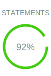
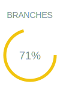
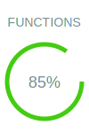

## Description 🤔

<details open>
  <summary>🇬🇧 English</summary>
  Welcome !
  This simulator is real estate investment calculator. It helps determine when it becomes more cost-effective to buy a property rather than continue renting. By considering various financial factors such as rental costs, purchase price, interest rates, notary fees, and potential tax deductions, the simulator compares the total costs of each option over a given period. This analysis allows you to make an informed decision and optimize your expenses based on your personal situation and the real estate market.

</details>

<details>
  <summary>🇫🇷 Français</summary>
  Bienvenue!
  Ce simulateur est une calculette d'investissement immobilier. Il aide à déterminer à quel moment il devient plus avantageux d'acheter un logement plutôt que de continuer à le louer. En prenant en compte divers facteurs financiers tels que le coût de la location, le prix d'achat, les taux d'intérêt, les frais de notaire, et les éventuelles déductions fiscales, le simulateur compare les coûts totaux de chaque option sur une période donnée. Grâce à cette analyse, on peut faire un choix éclairé et optimiser nos dépenses en fonction de notre situation personnelle et du marché immobilier.

</details>

<details>
  <summary>🇪🇸 Español</summary>
  ¡Bienvenido!
  Este simulador es una calculadora de inversión inmobiliaria. Ayuda a determinar cuándo resulta más ventajoso comprar una vivienda en lugar de seguir alquilándola. Al considerar diversos factores financieros, como el coste del alquiler, el precio de compra, los tipos de interés, los gastos notariales y las posibles deducciones fiscales, el simulador compara el coste total de cada opción durante un periodo determinado. Gracias a este análisis, podrá tomar una decisión informada y optimizar sus gastos en función de su situación personal y del mercado inmobiliario.

</details>

<details>
  <summary>🇩🇪 Deutsch</summary>
  Willkommen!
  Dieser Simulator ist ein Immobilieninvestitionsrechner. Er hilft Ihnen zu ermitteln, wann es vorteilhafter ist, eine Immobilie zu kaufen, anstatt sie weiterhin zu mieten. Unter Berücksichtigung verschiedener finanzieller Faktoren wie Mietkosten, Kaufpreis, Zinsen, Notargebühren und möglicher Steuerabzüge vergleicht der Simulator die Gesamtkosten jeder Option über einen bestimmten Zeitraum. Dank dieser Analyse können Sie eine fundierte Entscheidung treffen und Ihre Ausgaben basierend auf Ihrer persönlichen Situation und dem Immobilienmarkt optimieren.

</details>

## App link 🚀

This simple app is accessible [> on github-pages <](https://odysseu.github.io/HabitatCalc/)

## Deploy and try the simulator locally 💻

This is a static website merely using local files and javascript packages downloaded from the [jsdeliver **C**ontent **D**elivery **N**etwork](https://cdn.jsdelivr.net).


### Prerequisites

- **git**: Ensure you have git (version 2 or higher) installed. Download it from [git-scm.com](https://git-scm.com/downloads
- **python**: Ensure you have python (version 3.5 or higher) installed. Download it from [python.org](https://www.python.org/downloads/).

### Deploy

If you wish to deploy the app localy and visualise it in your browser :

- Clone the Repository:

  ```sh
  git clone https://github.com/odysseu/HabitatCalc.git
  ```

- Go to the project root :

  ```
  cd HabitatCalc
  ```

- Launch the app :

  ```sh
  python -m http.server
  ```

- Open in your favorite browser `http://localhost:8000/`

### Hint if developing in codespace

If you're using codespace, for exemple the URL could be `https://fictional-something-...-end.github.dev`, then you can add in the URL `-8000.app` and will be able to see the app at `https://fictional-something-...-end-8000.app.github.dev`

## Testing 🧪

**Test Coverage**

     

### Prerequisites

- **Node.js**: Ensure you have Node.js (version 16 or higher) installed. Download it from [nodejs.org](https://nodejs.org).
- **npm**: npm is included with Node.js. Ensure it's up-to-date.

### Setup

- Clone the Repository:

  ```sh
  git clone https://github.com/odysseu/HabitatCalc.git
  ```

- Go to the project root :

  ```
  cd HabitatCalc
  ```

- Install Dependencies:

  ```
  npm install
  ```

### Running Tests

To run the tests, use the following command:

  ```
  npm test
  ```

### Writing Tests

- **Framework**: We use [Jest](https://jestjs.io) for testing.
- **Test Files**: Place your test files in the `tests/` directory. Use the `.test.js` or `.spec.js` extensions.
- **Assertions**: Use Jest's built-in matchers for assertions.

#### Test files exemples

See the `*.test.js` files in the `tests/` directory for test file inspiration
